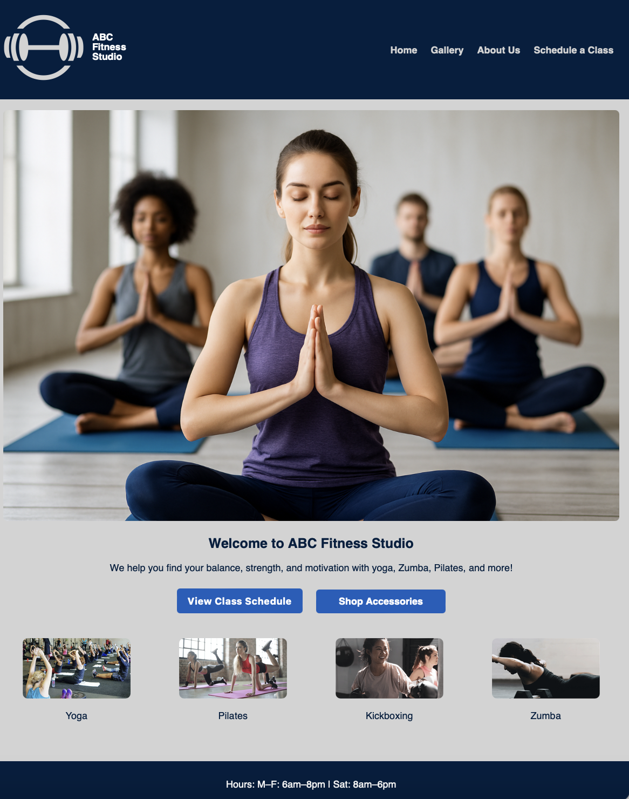
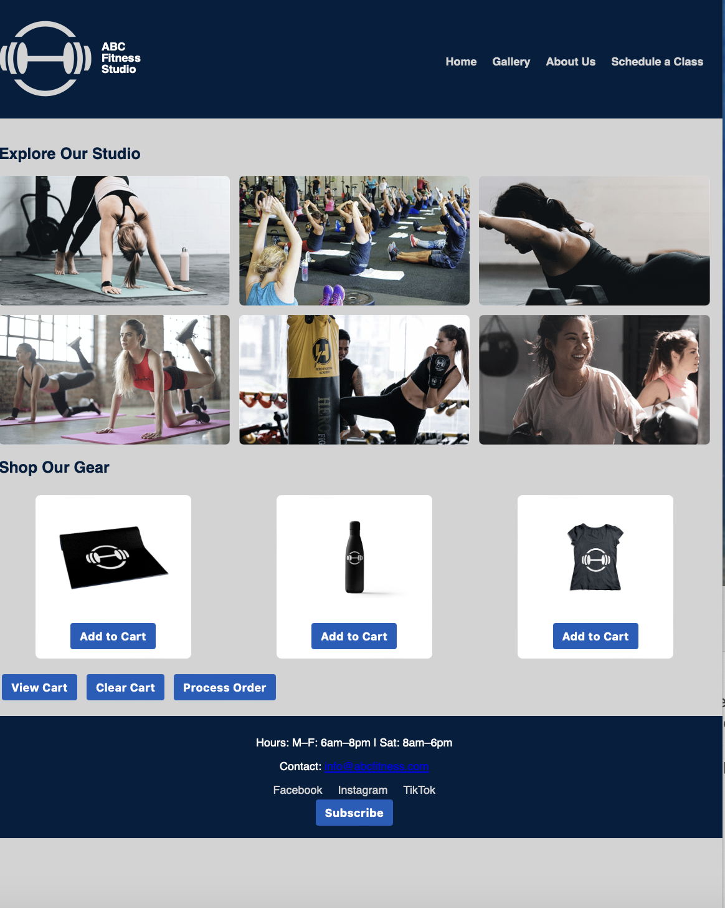
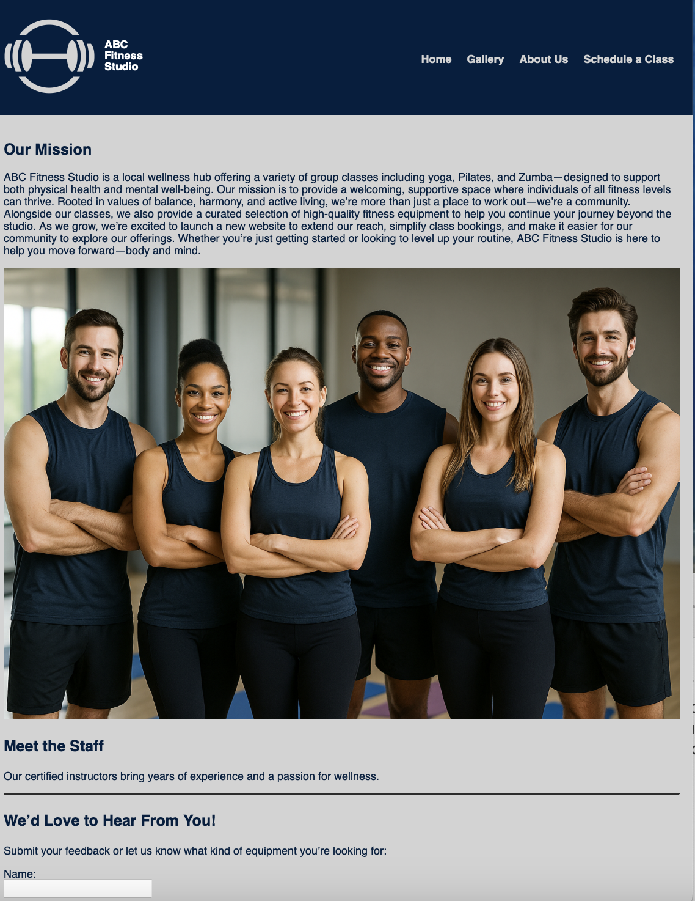
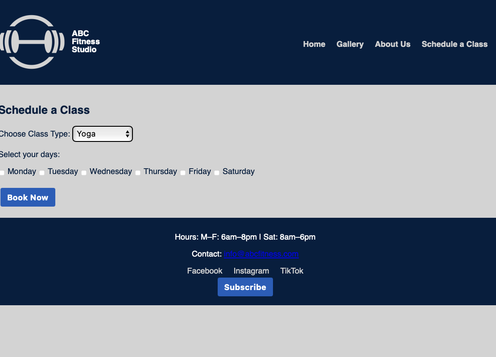

# ABC Fitness Studio Website

Welcome to the **ABC Fitness Studio** website repository! This project was created as part of a front-end web development course to showcase key skills in HTML, CSS, JavaScript, responsive design, web storage, and dynamic page behavior.

View the live website here: 👉 https://sherrimb.github.io/abc-fitness-studio/

---

## 🧘 Project Overview

The ABC Fitness Studio website provides a user-friendly experience for anyone interested in exploring wellness classes like yoga, Zumba, Pilates, and more. Visitors can explore the studio, browse accessories, schedule classes, and get in touch with staff — all in one responsive and accessible site.

---

## 🌐 Pages and Features

- **Home Page**  
  A welcoming hero section, class call-to-action buttons, and a visual overview of offerings.

- **Gallery Page**  
  Dynamic layout with images from the studio and a working shopping cart with `sessionStorage`.

- **About Us Page**  
  Introduces the studio’s mission and team, plus a contact form that uses `localStorage`.

- **Schedule a Class**  
  Allows users to book classes with dropdowns and checkboxes.

---

## ⚙️ Website Features

- Responsive navigation bar with Flexbox and media queries
- Subscription field with JavaScript alert validation
- “Add to Cart”, “View Cart”, and “Clear Cart” functions using `sessionStorage`
- Contact form with `localStorage` and input validation
- Clean, modern design using selected color palettes and typography

---

## 🎨 Design Elements

- **Color Palette 2:**
  - `#001F3F` (Nourish Navy)
  - `#20458E` (Bootcamp Blue)
  - `#634E99` (Pilates Purple)
  - `#155EBC` (Box Jump Blue)
  - `#D3D3D3` (Wellness Gray)

- **Font Color Used:**
  - `#001F3F` (Nourish Navy) — used for body text and headers

- **Typography (Option 2):**
  - Arial Bold, Comfortaa, and Calibri combinations for clean readability and a welcoming tone

---

## 💻 Technologies Used

- HTML5
- CSS3 (Flexbox, media queries)
- JavaScript (DOM manipulation, event handling)
- Web Storage API (`sessionStorage` and `localStorage`)
- Google Fonts: Comfortaa

---

## 🧪 Accessibility and RWD

- Color contrast tested with [Adobe Color Accessibility Tools](https://color.adobe.com/create/color-accessibility)
- Keyboard-friendly input forms
- Responsive layout on mobile, tablet, and desktop screens

---

## 📸 Screenshots

### 🏠 Homepage

### 🖼️ Gallery Page

### 📖 About Us Page

### 🗓️ Schedule a Class Page

---

## 👩‍💻 Created by

Sherri Killough  
🌐 [LinkedIn](https://www.linkedin.com/in/sherrikillough/)

---

## 📂 How to Use This Repo

1. Clone the repository  
   `git clone https://github.com/sherrimb/abc-fitness-studio.git`

2. Open `index.html` in your browser  
   Or upload the repo to GitHub Pages to deploy your own version

---

## 📬 Contact

For questions or feedback, feel free to connect via LinkedIn or reach out through the contact form on the site.
